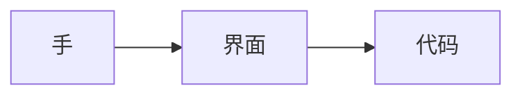
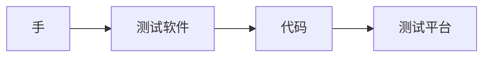

## 为什么自动化

什么是测试？

> 定义：软件测试是描述一种用来促进鉴定软件的正确性、完整性、安全性和质量的过程。

这就意味着要测试出 bug 或者漏洞需要在执行过程中要尽量让输入不正确，操作具有危险性和攻击性，要考虑不同情景下的反应。从现实意义来考虑，平时我们是怎么进行测试的？



手工操作点点点借助的是人脑的反应和聪明，为什么不用手点了呢？手会酸，脑子会累，会占据太多的时间。想一想为什么会学习自动化测试。我们都希望通过工具来解放我们的双手，大脑，眼睛。什么是自动化？

> 自动化是指机器设备、系统或过程（生产、管理过程）在没有人或较少人的直接参与下，按照人的要求，经过自动检测、信息处理、分析判断、操纵控制，实现预期的目标的过程。

平时我们接触到的自动化工具有很多。比如按键精灵自动加血加蓝，搜索引擎，以前找一篇文章要把所有的资料摊开，一页一页翻，现在直接列出来了。可以再编辑器里实现以下搜索。自动化测试课程里要学不少的测试软件吧？



使用了自动化测试软件以后还是觉得不够，因为有的测试需求比较复杂，包含几十上百个步骤，用软件测不出来，就算能实现也比较麻烦，这时候我们面临的问题就是：用软件定制化不高，对于复杂场景实现不了。

代码的定制性就非常高了，想实现什么功能可以自己去实现。到后面实现完以后那些不会编程的测试人员怎么办？不能让他们闲着，就要编写测试平台，让不太会代码的同学也可以轻松使用。

自动化测试是通过使用机器系统来鉴定软件的正确性、完整性、安全性和质量。

我们的目标是通过编写代码，能够代替我们日常用手去操作的测试工作，要求你尽可能的掌握编程语言和相关代码库的使用和实现原理。


## HTML 语言

先看一个页面：百度。
```html
<!DOCTYPE html>
<html>
<head>
    <meta charset="utf-8" />
    <meta http-equiv="X-UA-Compatible" content="IE=edge">
    <title>柠檬班</title>
    <meta name="viewport" content="width=device-width, initial-scale=1">
    <link rel="stylesheet" type="text/css" media="screen" href="main.css" />
    <script src="main.js"></script>
    <noscript></noscript>
</head>
<body>
    <div>hello</div>
    <script></script>
</body>
</html>
```
meta表示什么？可以上 w3school 查看。 
结构怎么感觉有点熟悉？跟字典有点相似 `{"name":"test", "tags":{"game":"王者","grade":100}}`


### 标记型（性）语言

> 定义：标记语言是一种将文本以及文本相关的其他信息结合起来，展现出关于文档结构和数据处理细节的电脑文字编码。

日常生活中怎么标记？
- 游戏厅：开始，加速，刹车，投币。 red: stop  green: start
- 读书的时候女生会有不同颜色的比来表示 重点，难点，易错的。
- 字典上方 a, b, c 的小纸片。
- 代码标记。python 中的 a，def，class

作用是什么？让我们更加方便，更加容易的找到我们想要的。编程中就出现了很多标记语言，html，xml，markdown，rst

如果让我们自己来设计一款标记性语言怎么来设计？
- 标记符号 tag，key
- 标记的内容 value
- 各种属性，什么颜色的，什么形状的。
```
title(color="red") | 柠檬
paramgraph | 欢迎来到
button | 发送
```

> 定义：HTML 全名 HyperText Markup Language(超文本标记语言), 是一种用于创建网页的标准标记语言。常常和 css js一起使用来构建漂亮的页面。


