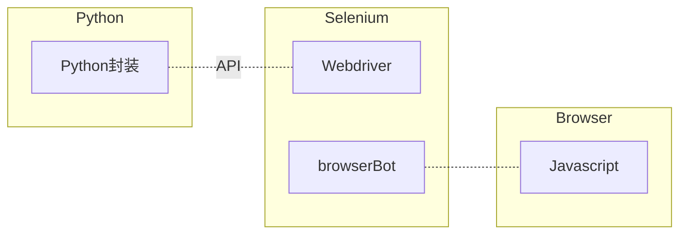
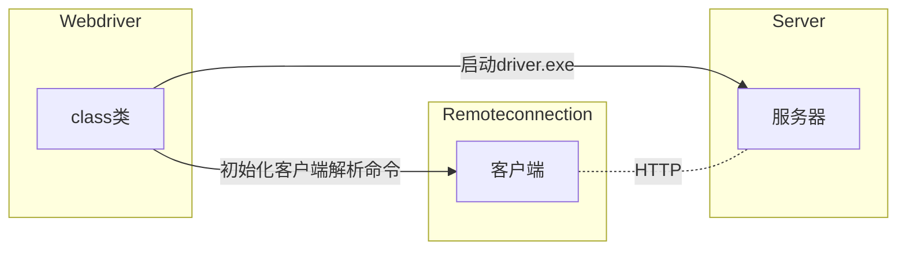

## 安装
- pip install selenium
- 下载 webdriver。chrome 通过 [官方下载 ](https://sites.google.com/a/chromium.org/chromedriver/downloads) 或者 [镜像下载](https://registry.npmmirror.com/binary.html)。和浏览器的版本对应（71比较稳定）。
- chromedriver 放入环境变量目录，


## 快速开始

```python
from selenium.webdriver import Chrome

driver = Chrome(port=4488)
driver.get("http://www.baidu.com")
```


## 元素定位

```python
# 找一个
el = driver.find_element('id', 'value')
# 找多个
els = driver.find_elements('id', 'value')
```

find_element 和 find_elements 的区别在于：
- find_element 找一个元素，如果存在多个，只会返回第一个。如果找不到，报错；
- find_elements 找多个元素，存在列表当中。如果找不到，返回空列表。


元素定位方式有： 
- id，具有唯一性，可以优先使用；
- name,  通常在 input 元素当中有；
- class name, 像 vue 这样的框架可能大多数情况使用这个
- tag name, 测试领域基本没什么用
- link text, 定位 a 标签时很有用
- partial link text, 定位 a 标签时很有用
- xpath 常用来定位复杂元素
- css selector 常用来定位复杂元素


找到的元素对象叫 WebElement，可以获取元素的属性，也可以调用元素方法：

```python
el.get_attribute('name')
el.click()
```


元素定位时不管选用哪种方式，都要避开那些可能会动态变化的属性，通常含有数字或者加密字符串。


## 原理




Selenium-Binding 的实现：



- webdriver 类干了两件事：初始化了一个 server 实例 和 remoteConnect 实例。
- server 实例就干了一件事：启动了driver.exe，因此搭了一个本地服务器，你可以通过浏览器访问这个服务器。
- remoteConnect 就是做一个客户端，类似于 requests 干的事，当然这里有但是标准库 urlib3。
- 其他还定义了一些 command，然后把 command 传给 connect 做为请求参数，访问对应的 url 地址。


我们可以通过一些简单的测试来验证这些想法，既然实际上是访问 url 地址传参数，我只要知道传的是什么参数，那这些东西我都可以不要了，我直接在浏览器输入网址和参数，或者通过 requests 库来请求也可以啊。

在 remoteConnection 里找一下看有没有对应的参数可以输入，很多都有一个叫 session 的变量，暂时还不知道这个是什么，通过`/sessions`这个地址看一下有没有 session 可以用，没有，通过初始化来操作把。

> 注意：以后再研究一下 session 的创建机制。

```python
import requests
from selenium.webdriver import Chrome

driver = Chrome(port=4488)
my_session = driver.session_id
print(my_session)

# page = driver.get("http://www.baidu.com")

data = {"url": "http://www.baidu.com"}
req = requests.post("http://localhost:4488/session/{}/url".format(my_session), json=data)

print(req.content)

# ele = driver.find_element_by_id('kw')
# print(ele)
```


## 启动 selenium 可能遇到的问题

### 自动化控制
1， 打开浏览器有 windows 提示：

解决：

https://blog.csdn.net/xm_csdn/article/details/84820412 

```python
option = webdriver.ChromeOptions()
# 配置参数 禁止 Chrome 正在受到自动化软件控制
option.add_argument('disable-infobars')
# 配置参数禁止data;的出现
option.add_argument('user-data-dir=C:\python27\profile')
 
 
# 打开chrome浏览器
driver = webdriver.Chrome(options=option)
```


### session 无法创建

由于对计算机资源限制，可能无法创建 session, 添加：

```python
ChromeOptions options = new ChromeOptions();
options.addArguments("enable-automation");
options.addArguments("--headless");
options.addArguments("--window-size=1920,1080");
options.addArguments("--no-sandbox");
options.addArguments("--disable-extensions");
options.addArguments("--dns-prefetch-disable");
options.addArguments("--disable-gpu");
options.setPageLoadStrategy(PageLoadStrategy.NORMAL);
```


## todo
- headless


