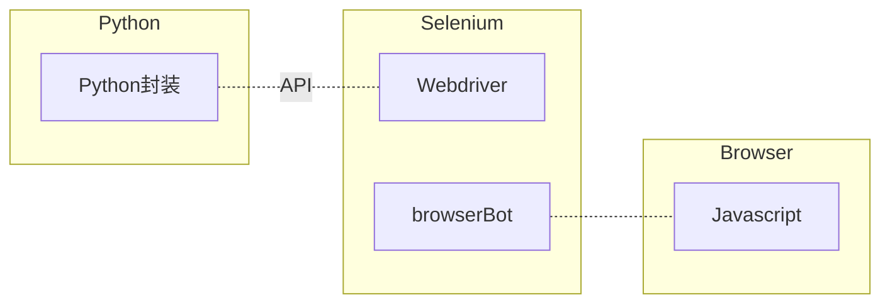
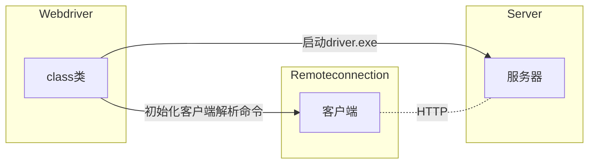

## 安装

selenium 提供了很多编程语言的支持，以下操作都是以 Python 为例。 在使用 Selenium 前，首先需要安装好执行环境：1、浏览器；2、chromedriver程序；3、selenium安装包

- pip install selenium

- 下载 webdriver。chrome 通过 官方下载 或者 镜像下载。和浏览器的版本对应。

- 放入安装目录，python 安装目录或者其他任何地方。


## 启动浏览器

安装好后，编写以下程序，就能得到一个正常的浏览器：

```Python
from selenium import webdriver
driver = webdriver.Chrome()
```


## 退出浏览器

在自动化程序运行后，一定要记得关闭浏览器。 如果不关闭，seleium程序会占据后台运行资源，导致运行速度变慢。如果存在多个标签页，可以通过 close 关闭当前标签页。

```Python
driver.close()
driver.quit()
```


如果你实在容易忘记退出浏览器，使用上下文管理器是个不错的选择，它会在你运行程序后自动退出浏览器

```Python
from selenium import webdriver

# 4、如果不记得使用 driver.quit() 
with webdriver.Chrome() as driver:
    do_something()
```


## 访问 URL 地址

```Python
driver.get("http://www.jiubing.site")
```


## 最大化窗口

```Plain Text
driver.maximize_window()
```


## 最小化窗口

```Plain Text
driver.minimize_window()
```


## 返回上一个页面

```Plain Text
driver.back()
```


## 前进

```Plain Text
driver.forward()
```


## 刷新当前页面

```Plain Text
driver.refresh()
```


## 演示案例

通过以下代码，可以看到具体的演示效果

```Python
import time

from selenium import webdriver

# 2、得到了一个 Chrome 浏览器, 首字母大写
driver = webdriver.Chrome()

# 访问网址
driver.get('https://petstore.octoperf.com/actions/Catalog.action')
time.sleep(2)

# 刷新
driver.refresh()

driver.get('http://douban.com')

# 退回上一个网页 back
time.sleep(2)
driver.back()

# 前进
time.sleep(2)
driver.forward()

# 放大
time.sleep(2)
driver.maximize_window()

# 缩小，最小化
time.sleep(2)
driver.minimize_window()

# 关闭当前窗口
driver.close()

# 3、一定要记得关闭浏览器驱动
# 如果你不关闭，chromedriver 就会停留在后台。
driver.quit()
```


## 获取页面属性

在浏览器执行过程中，可以随时获取浏览器的状态和属性。通过下面代码能及时得到当前页面的标题，url 以及源代码展示：

```Python
driver = webdriver.Chrome()

# 访问网址
driver.get('https://petstore.octoperf.com/actions/Catalog.action')

print(driver.current_url)
print(driver.title)
print(driver.page_source)

# 3、一定要记得关闭浏览器驱动
# 如果你不关闭，chromedriver 就会停留在后台。
driver.quit()
```


## 元素定位

```python
# 找一个
el = driver.find_element('id', 'value')
# 找多个
els = driver.find_elements('id', 'value')
```

find_element 和 find_elements 的区别在于：
- find_element 找一个元素，如果存在多个，只会返回第一个。如果找不到，报错；
- find_elements 找多个元素，存在列表当中。如果找不到，返回空列表。


元素定位方式有： 
- id，具有唯一性，可以优先使用；
- name,  通常在 input 元素当中有；
- class name, 像 vue 这样的框架可能大多数情况使用这个
- tag name, 测试领域基本没什么用
- link text, 定位 a 标签时很有用
- partial link text, 定位 a 标签时很有用
- xpath 常用来定位复杂元素
- css selector 常用来定位复杂元素


找到的元素对象叫 WebElement，可以获取元素的属性，也可以调用元素方法：

```python
el.get_attribute('name')
el.click()
```


元素定位时不管选用哪种方式，都要避开那些可能会动态变化的属性，通常含有数字或者加密字符串。


- 鼠标

- - 点击
  - 双击
  - 右击
  - 拖动
  - 悬停

- 键盘

- - 输入
  - Key Down
  - Key Up

- 组件

- - 单选
  - 多选
  - 下拉框选择

- 其他常用

- - 窗口滚动
  - 滚动到可视范围
  - JS 操作
  - 上传
  - 下载
  - 截图

**悬停**

```python
 def test_01(self, page):
     page.get('https://www.runoob.com/html/html-tutorial.html')
     # 悬停
     actions = ActionChains(page)
     menu = page.find_element(By.XPATH, "//a[contains(text(),'HTML / CSS')]")
     actions.move_to_element(menu).perform()
 
     html_el = page.find_element(By.LINK_TEXT, "CSS 教程")
     html_el.click()
     time.sleep(3)
```

**拖动**

```python
 def test_drag_and_drop(page: Page):
     page.get('https://demos.telerik.com/kendo-ui/dragdrop/index')
     start_el = page.find_element(By.ID, "draggable")
     end_el = page.find_element(By.ID, "droptarget")
     actions = ActionChains(page)
     actions.drag_and_drop(start, end).perform()
```


**复制粘贴**

```python
def test_drag_and_drop(self,page):
     page.get('https://www.baidu.com')
     page.find_element(By.ID, 'kw').send_keys('明天再学')
 
     actions = ActionChains(page)
     actions.key_down(Keys.CONTROL).send_keys('a').key_up(Keys.CONTROL)
     actions.perform()
 
     actions.key_down(Keys.CONTROL).send_keys('c').key_up(Keys.CONTROL)
     actions.perform()
 
     actions.key_down(Keys.CONTROL).send_keys('v').key_up(Keys.CONTROL)
     actions.perform()
 
     actions.key_down(Keys.CONTROL).send_keys('v').key_up(Keys.CONTROL)
     actions.perform()
```

 

**窗口切换**

```python
 def test_switch_window(page):
     page.get("http://www.baidu.com")
     page.find_element(By.XPATH, '//input[@id="kw"]').send_keys('明天再学')
     page.find_element(By.ID, 'su').click()
     #点击打开新窗口
     page.find_element(By.LINK_TEXT, '知乎').click()
     #切换窗口
     page.switch_to.window(page.window_handles[-1])
     page.find_element(By.NAME, 'username')
```


**iframe切换**

```python
 def test_switch_iframe(page):
     page.get('https://v4.ketangpai.com/User/login.html')
     page.find_element(By.LINK_TEXT, '微信登录').click()
     #iframe切换
     iframe = page.find_element(By.CSS_SELECTOR, '#login_container>iframe')
     page.switch_to.frame(iframe)
     
     qrcode = page.find_element(By.CSS_SELECTOR, '.qrcode')
     print(qrcode.get_attribute('src'))
```


## 原理




Selenium-Binding 的实现：



- webdriver 类干了两件事：初始化了一个 server 实例 和 remoteConnect 实例。
- server 实例就干了一件事：启动了driver.exe，因此搭了一个本地服务器，你可以通过浏览器访问这个服务器。
- remoteConnect 就是做一个客户端，类似于 requests 干的事，当然这里有但是标准库 urlib3。
- 其他还定义了一些 command，然后把 command 传给 connect 做为请求参数，访问对应的 url 地址。


我们可以通过一些简单的测试来验证这些想法，既然实际上是访问 url 地址传参数，我只要知道传的是什么参数，那这些东西我都可以不要了，我直接在浏览器输入网址和参数，或者通过 requests 库来请求也可以啊。

在 remoteConnection 里找一下看有没有对应的参数可以输入，很多都有一个叫 session 的变量，暂时还不知道这个是什么，通过`/sessions`这个地址看一下有没有 session 可以用，没有，通过初始化来操作把。

> 注意：以后再研究一下 session 的创建机制。

```python
import requests
from selenium.webdriver import Chrome

driver = Chrome(port=4488)
my_session = driver.session_id
print(my_session)

# page = driver.get("http://www.baidu.com")

data = {"url": "http://www.baidu.com"}
req = requests.post("http://localhost:4488/session/{}/url".format(my_session), json=data)

print(req.content)

# ele = driver.find_element_by_id('kw')
# print(ele)
```


## 启动 selenium 可能遇到的问题

### 自动化控制
1， 打开浏览器有 windows 提示：

解决：

https://blog.csdn.net/xm_csdn/article/details/84820412 

```python
option = webdriver.ChromeOptions()
# 配置参数 禁止 Chrome 正在受到自动化软件控制
option.add_argument('disable-infobars')
# 配置参数禁止data;的出现
option.add_argument('user-data-dir=C:\python27\profile')
 
 
# 打开chrome浏览器
driver = webdriver.Chrome(options=option)
```


### session 无法创建

由于对计算机资源限制，可能无法创建 session, 添加：

```python
ChromeOptions options = new ChromeOptions();
options.addArguments("enable-automation");
options.addArguments("--headless");
options.addArguments("--window-size=1920,1080");
options.addArguments("--no-sandbox");
options.addArguments("--disable-extensions");
options.addArguments("--dns-prefetch-disable");
options.addArguments("--disable-gpu");
options.setPageLoadStrategy(PageLoadStrategy.NORMAL);
```


## todo
- headless


